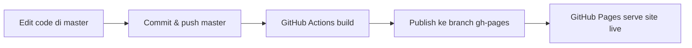

# Deploy Production

Dokumentasi alur deploy site portfolio ke GitHub Pages.

## Ringkasan

| Item | Nilai |
| --- | --- |
| Repo source | `https://github.com/feriromadhona1/feriromadhona1.github.io.git` |
| Branch source production | `master` |
| Branch publish live | `gh-pages` |
| URL production | `https://feriromadhona1.github.io/` |
| CI/CD | GitHub Actions (`.github/workflows/deploy.yml`) |

## Branch yang dipakai

### `master` — branch production source

Branch ini adalah **satu-satunya branch** yang boleh dipakai untuk deploy production.

Isinya:
- source code Next.js
- komponen React/TypeScript
- asset di `public/`
- konfigurasi build (`next.config.js`, `postcss.config.mjs`, dll.)

Deploy production selalu dimulai dari branch ini.

### `gh-pages` — branch hasil build live

Branch ini **bukan tempat development**.

Isinya hanya hasil static export dari build production:
- `index.html`
- `_next/static/...`
- `assets/...`

Branch ini di-update otomatis oleh GitHub Actions setelah push ke `master`.

### Branch lain

| Branch | Status | Catatan |
| --- | --- | --- |
| `development` | legacy / dev lama | tidak dipakai untuk production |
| `main` | hampir kosong | hanya initial commit, abaikan untuk deploy |
| `gh-pages` | output live | jangan edit manual kecuali debugging |

## Alur deploy production



Langkah detail:

1. Developer bekerja di branch `master`
2. Perubahan di-commit dan di-push ke `origin/master`
3. GitHub Actions menjalankan workflow `Deploy GitHub Pages`
4. Workflow melakukan:
   - `npm ci`
   - `npm run build`
   - publish folder `out/` ke branch `gh-pages`
5. GitHub Pages melayani site live dari branch `gh-pages`

## Cara deploy dari local

Jalankan command dari folder repo source:

```bash
cd /Library/WebServer/feriromadhona-site
git checkout master
```

### Deploy normal

Jika perubahan sudah di-commit:

```bash
npm install
npm run deploy
```

Script `npm run deploy` akan:
1. memastikan branch aktif adalah `master`
2. memastikan working tree bersih
3. menjalankan `npm run build` sebagai smoke test lokal
4. `git fetch` + `git pull --rebase origin master`
5. `git push origin master`

Push ke `master` inilah yang memicu deploy production di GitHub Actions.

### Deploy jika masih ada perubahan belum commit

```bash
git add .
git commit -m "update site"
npm run deploy
```

## Command manual (alternatif)

Jika tidak ingin memakai `npm run deploy`:

```bash
git checkout master
git pull --rebase origin master
npm install
npm run build
git push origin master
```

Setelah push ke `master`, cek status workflow di GitHub Actions.

## Prasyarat GitHub

Pastikan setting berikut sudah benar di repo GitHub:

1. **Settings → Pages**
   - Source: **Deploy from a branch**
   - Branch: `gh-pages`
   - Folder: `/ (root)`

2. **Actions**
   - Workflow `.github/workflows/deploy.yml` aktif
   - Push ke `master` otomatis menjalankan deploy

## Monitoring deploy

Setelah push ke `master`, cek:

- Actions: `https://github.com/feriromadhona1/feriromadhona1.github.io/actions`
- Site live: `https://feriromadhona1.github.io/`

Deploy sukses jika workflow `Deploy GitHub Pages` berstatus **success**.

## Troubleshooting

### `npm run deploy` gagal: dependency belum terpasang

```bash
npm install
```

Jalankan dari folder repo source, bukan dari folder clone test lain.

### `npm run deploy` gagal: working tree belum bersih

Commit atau stash perubahan dulu:

```bash
git add .
git commit -m "update site"
```

### Push ke `master` ditolak (fetch first)

```bash
git pull --rebase origin master
git push origin master
```

### Foto/CSS live belum update

1. pastikan push ke branch `master`, bukan `development`
2. cek workflow GitHub Actions sudah **success**
3. hard refresh browser: `Cmd + Shift + R`

### Branch yang tidak boleh dipakai deploy

Script deploy akan menolak branch selain `master`:

```text
Deploy diblok dari branch "development". Pindah ke branch "master" untuk menjalankan deploy.
```

## Catatan penting

- Jangan deploy production dari `development`, `main`, atau `gh-pages`
- Jangan edit manual branch `gh-pages` untuk update fitur; selalu lewat `master`
- Folder `out/` hasil build lokal tidak perlu di-commit ke `master`
- Tailwind production memakai Tailwind v4 via `@import "tailwindcss"` di `src/styles/globals.css`
